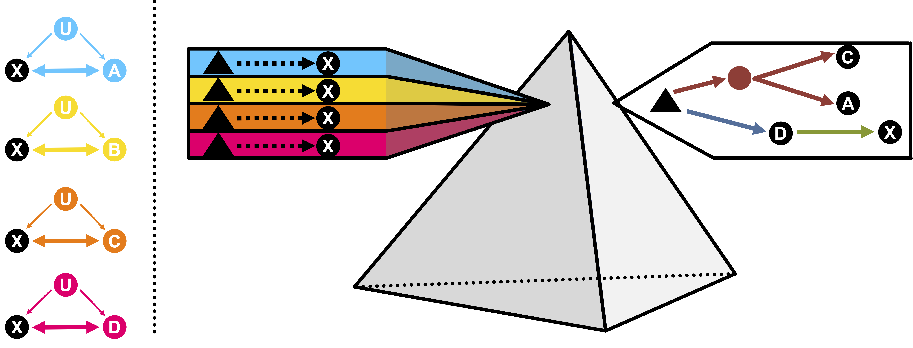

<!-- README.md is generated from README.Rmd. Please edit that file -->

```{r, include = FALSE}
knitr::opts_chunk$set(
  collapse = TRUE,
  comment = "#>",
  fig.path = "man/figures/README-",
  out.width = "100%"
)
```

# PRISM Shiny application

<!-- badges: start -->
<!-- badges: end -->

## Principle of PRISM


[PRISM](https://github.com/martintnr/PRISM) takes as input GWAS summary statistics of multiple traits and outputs significant labeled variant-trait effects. Further information can be found in our [pre-print](https://doi.org/10.1101/2024.06.01.24308193).

## Results visualization

You can visualize PRISM results and the causal network of any variant on our [Shiny visualization tool](https://verbam01.shinyapps.io/PRISM/). The app can be launched locally from R using the following command:
```{r lshiny, eval = FALSE}

shiny::runGitHub(repo = "martintnr/PRISMApp", subdir = "")

```


